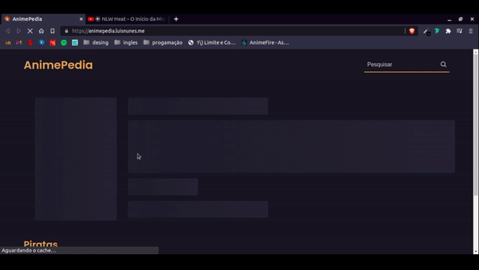

<h1 align="center">
    <a href="https://animepedia.luisnunes.me/">🔗 AnimePedia</a>
</h1>

<p align="center">🍿 Site com mais de 1000 animes, nele é possivel visualizar algumas informações sobre os animes</p>

<p align="center">
  
  
  
</p>

<h4 align="center"> 
	✔️ 🚀 Concluido  ✔️
</h4>

<p align="center">
 <a href="#Features">Features</a> •
 <a href="#Technologies">Technologies</a> •
 <a href="#Getting-started">Getting started</a> •
 <a href="#autor">Autor</a>
</p>


## Features 

- [x] Skeleton
- [x] Carrosel
- [x] Pesquisar animes
- [x] Visualizar informação de um anime


## Technologies

This project was developed using the following technologies:

- [NextJS](https://nextjs.org/)
- [DatoCMS](https://www.datocms.com/)


## Getting started

Clone the project and access the folder.

```bash
$ git clone https://github.com/Luis-Felipe-N/Anime.git
$ cd Anime
```

Follow the steps below:
```bash
# Install the dependencies
$ npm i
$ yarn

# Start the project
$ npm start
$ yarn start
```
The app will be available for access on your browser at http://localhost:3000

## Autor
---

<p align="center" href="https://blog.rocketseat.com.br/author/thiago/">
 
 <br />
 <sub><b>Luis Felipe</b></sub></a> <a href="https://blog.rocketseat.com.br/author/thiago//" title="Rocketseat">🚀</p>


<p align="center" >Feito com ❤️ por Luis Felipe</p>